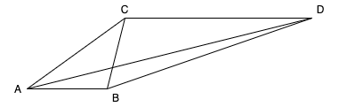

```{r setup, include=FALSE}
knitr::opts_chunk$set(echo = TRUE)
```

## Homework 4

#### Part A

##### quesstion a

It is possible to arrange the four points on a straight line. For example, from left to right, the points can be A, B, C, and D. Besides, $AB = 10$,$BC = 20$, and $CD = 15$. Then all requirements can be satisfied.

#### Part B

Since AD is the biggest distance, these two points must be the leftest or rightest points. Consequently, B and C muct be in the midde of A and D. There are two possible conditions:

1. ABCD: given $BD < AC$, we have $BC + CD < AB + BC$. This is equal to $CD < AB$, which break the requriement.

2. ACBD: Then $AB > AC$ and $AB > CB$ break the requriements as well.

Consequently, there is no case we can arrage this four points on a line.

#### Part C

If we can arrange the points in a two-dimension plat, then it is doable. Example can be seem from plot below.




#### Part B

##### quesstion 1

```{r}
d1 <- c(0.914,-0.660,-0.649,0.923,-0.589)
d2 <- c(-0.229,-0.078,-0.648,0.172,0.716)
distance <- c()
distance_matrix <- matrix(0,nrow = 5,ncol = 4)
for (i in 1:4){
  for (j in (i+1):5){
    d <- sqrt((d1[i] - d1[j])^2 + (d2[i] - d2[j])^2)
    distance <- c(distance,d)
    distance_matrix[j,i] <- d
  }
}
round(distance_matrix,2)
```


##### quesstion 2

The rank of proximity data is: 

$\delta_{14}=125$, $\delta_{24}=600$, $\delta_{25}=670$, $\delta_{35}=675$, $\delta_{13}=800$, $\delta_{24}=850$, $\delta_{12}=875$, $\delta_{15}=890$, $\delta_{45}=890$, and $\delta_{34}=925$.

The model distance is:

$d_{14}=0.40$, $d_{24}=1.60$, $d_{25}=0.80$, $d_{35}=1.37$, $d_{13}=1.62$, $d_{24}=1.60$, $d_{12}=1.58$, $d_{15}=1.78$, $d_{45}=1.61$, and $d_{34}=1.77$.

I use the free ordering approach. After several iteration of transformation, I get:

$f(\sigma)=(0.4, 1.2, 1.2, 1.37, 1.6, 1.6, 1.6, 1.695, 1.695, 1.77)$

```{r}
sigma <- c(125,600,670,675,800,850,875,890,890,925)
f_sigma <- c(0.4, 1.2, 1.2, 1.37, 1.6, 1.6, 1.6, 1.695, 1.695, 1.77)
d <- c(0.4,1.6,0.8,1.37,1.62,1.6,1.58,1.78,1.61,1.77)
plot(sigma,f_sigma,type="b",lwd=5, pch=15)
points(sigma,d)
```


##### quesstion 3

I choose to use the recommended stress fomula 2.
```{r}
sqrt((sum((f_sigma-d)^2) / sum((d - mean(d))^2)))
```

#### Part C

##### quesstion a

###### Issue (1) and (2)

```{r message=FALSE, warning=FALSE}
library(readr)
library(MASS)

CRIMES_PRX_clean <- read_csv("CRIMES_PRX_clean.csv")
crime.label <- c()
for (i in 2:nrow(CRIMES_PRX_clean)){
  crime.label <- c(crime.label,CRIMES_PRX_clean[i,1])  
}
CRIMES_PRX_clean <- as.matrix(CRIMES_PRX_clean)
CRIMES_PRX_clean <- CRIMES_PRX_clean[2:nrow(CRIMES_PRX_clean),2:ncol(CRIMES_PRX_clean)]
rownames(CRIMES_PRX_clean) <- 1:18
colnames(CRIMES_PRX_clean) <- 1:18


crime <- matrix(NA,nrow = 18,ncol = 18)

for (i in 1:17){
  for (j in (i+1):18){
    crime[i,j] <- as.numeric(CRIMES_PRX_clean[j,i])
    crime[j,i] <- as.numeric(CRIMES_PRX_clean[j,i])
  }
}
diag(crime) <- 0

stress <- c()
for (i in 1:8){
  crime.dist <- dist(crime)
  crime.mds <- isoMDS(crime.dist,k = i)  
  print(crime.mds$stress)
  crime.sh <- Shepard(crime.dist, crime.mds$points)
  plot(crime.sh, pch = ".")
  lines(crime.sh$x, crime.sh$yf, type = "S")
  stress <- c(stress,crime.mds$stress)
}

plot(stress,type = 'l')
```

With more dimension, the stress will always decrease. But the difficulity of interpretaion will also increase. The decrease of stree is big between dimension of 1 and 2, but the decreases are not obvious after that. I pick 2 dimension.

###### Issue (3) 

```{r}

crime.mds <- isoMDS(crime.dist,k = 2)  
plot(crime.mds$points, type = "n",xlim = c(-150,150),ylim = c(-150,150))
text(crime.mds$points, labels = as.character(crime.label))
```

The first dimension is about Criminal motivation.

The second dimension is about level of vialence. 

##### quesstion b


```{r}
y <- c(7.83,6.08,8.50,2.17,6.92,6.42,8.33,4.67,7.96,8.96,6.46,7.46,8.71,5.21,6.71,6.83,4.63,5.50)
x1 <- as.numeric(crime.mds$points[,1])
x2 <- as.numeric(crime.mds$points[,2])
data <- cbind(x1,x2,y)
data <- cbind(data,as.character(crime.label))
colnames(data) <- c("x1","x2","Y","stim")
data <- as.data.frame(data)
data
regression <- lm(formula = y~x1+x2)
summary(regression)
plot(regression)
```

