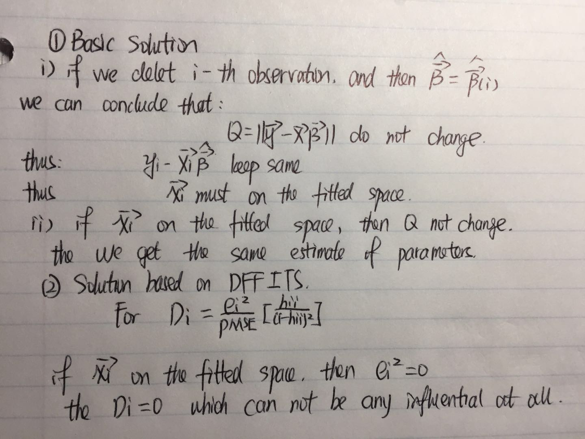

```{r setup, include=FALSE}
knitr::opts_chunk$set(echo = TRUE)
```

# Homework seven
## 8.6
### problem:a

Model: $Y_{i}=\beta_0+\beta_1x_i+\beta_{11}x_i^{2}+\varepsilon_i$
$f(x_i | \theta)=\frac{x^{\alpha-1}\lambda^{\alpha}e^{-\lambda x}}{\Gamma(\alpha)}$


```{r}
# solution one (use the R funtion)
setwd("C:/Users/cheny/Desktop/study/linear regression model/homework/homework record/Homework seven")
data_8.6 <- read.table('8.6.txt',header = FALSE,col.names = c('Y','X')) 

data_8.6$X_centered <- scale(data_8.6$X,center = TRUE,scale = FALSE)
data_8.6$X_2 <- (data_8.6$X_centered)^2

reg_8.6 <- lm(data = data_8.6, Y~X_centered+X_2)
summary(reg_8.6)

library(ggplot2)
ggplot(data = data_8.6)+
        geom_point(mapping = aes(x=X,y=Y))+
        geom_line(mapping = aes(x=X,y=fitted(reg_8.6)),col='steelblue',lwd=1)+
        labs(title='the ploynomial regression',x='age',y='steroid')
```

```{r}
# solution two (show every detail in the process)

## x matrix
x <- matrix(ncol = 3,nrow = nrow(data_8.6))
x[,1] <- 1
x[,2] <- data_8.6[,3]
x[,3] <- data_8.6[,4]
head(x)

## y matrix
y <- as.matrix(data_8.6$Y)
head(y)

## estimate the parameters
b <- solve(t(x)%*%x) %*% t(x) %*% y
b
```


**analysis**

The regression result:

$\widehat{Y}= 21.09416 + 1.13736 x-0.11840x^{2},x=X-\bar{X}$

As we can see in the plot, the line fit the data very well. And according to $R^{2}=0.8143$, the regression seems to be a good fit of the data.


<br>

###problem b 

$H0:\beta_1 = \beta_{11} = 0$ and $Ha:\beta_1\neq0 \  or\  \beta_{11}\neq0 $
```{r}
anova(reg_8.6)
```
as we can see $MSR=\frac{SSR(x)+SSR(x^{2})}{df}=\frac{793.28+252.99}{2}=523.135$,while $MSE=9.94$

Thus: $F^{*}=\frac{MSR}{MSE}=\frac{523.135}{9.94}=52.63$

```{r}
qf(0.99,2,24)
```

Clearly,$F(0.99,2,24)=5.613591$, thus$F^{*}\leq F(0.99,2,24)$.Conclude Ha.


<br>

### problem c
```{r}
x_h <- matrix(c(1,10,10^2,1,15,15^2,1,20,20^2),ncol=3)
x_h <- t(x_h)
```

```{r}
# here g=3,n=27,p=3
W <- sqrt(3*qf(0.99,3,24))

B <- qt(1-0.01/(2*3),24)


y_h <- x_h %*% b

MSE <- anova(reg_8.6)$`Mean Sq`[3]

s_2_b <- MSE * solve(t(x)%*%x)

s_2_y_h <- x_h %*% s_2_b %*% t(x_h)

s_2_y_h <- matrix(c(sqrt(s_2_y_h[1,1]),sqrt(s_2_y_h[2,2]),sqrt(s_2_y_h[3,3])),ncol = 1)

# solution one (Bnoferroni)
CI1 <- cbind(y_h-B*s_2_y_h,y_h+B*s_2_y_h)
CI1


# solution two (Working-Hotelling)
CI2 <- cbind(y_h-W*s_2_y_h,y_h+W*s_2_y_h)
CI2

library(ggplot2)
ggplot()+
        geom_point(aes(x=c(10,15,20),y=y_h))+
        geom_point(aes(x=c(10,15,20),y=CI1[,1]),col='red') +
        geom_point(aes(x=c(10,15,20),y=CI1[,2]),col='red') +
        geom_point(aes(x=c(10,15,20),y=CI2[,1]),col='blue') +
        geom_point(aes(x=c(10,15,20),y=CI2[,2]),col='blue')
```


<br>


### problem d

```{r}
# calculate the point estimate of y
Y_new <- reg_8.6$coefficients[1] + reg_8.6$coefficients[2]*15 + reg_8.6$coefficients[3]*15^2 
Y_new

t <- qt(0.995,24)
# MSE=9.94
#calculate the standard deviation of y_new
S_2_pred_15 <- sqrt(s_2_y_h[2,1]^2 + MSE)


CI3 <- c((Y_new + t*S_2_pred_15),(Y_new - t*S_2_pred_15))
CI3

```


<br>

### problem e:
**T-TEST**
```{r}
summary(reg_8.6)
```

As we can see, the t-test for the x_2.

$H0=\beta_{11}=0,Ha=\beta_{11}\neq0$

$s(b_{11})=0.02347$ and $t^{*}=\frac{b_{11}}{s(b_{11})}=\frac{-0.11840}{0.02347}=-5.045$

while
```{r}
qt(0.995,24)
```

Thus$|t^{*}|\geq t(0.995,24)$. Conclude Ha.
Or we can easily see the result in the summary that the p-value of the quadratic term is less that 0.01 which indicate that $\beta_{11}\neq0$

**partial F-TEST**
```{r}
anova(reg_8.6)
```

As we can see: $SSR(x^2|x)=252.99$ and $SSE(x,x^2)=238.54$, $F^*=\frac{\frac{252.99}{1}}{\frac{238.54}{24}}=25.453$
```{r}
qf(0.99,1,24)
```

Clearly$F^*\leq F(0.99,1,24)$, conclude H0


<br>

### problem f:


the model we used for regression:$\widehat{Y}=b_0+b_1x_i+b_{11}x_i^{2},x=X-\bar{X}$ 

the orginal model: $\widehat{Y}=b_0^{'}+b_1^{'}x_i+b_{11}^{'}x_i^{2}$

Thus: $b_0^{'}=b_0-b_1\bar{X}+b_{11}\bar X^{2}$
and $b_1^{'}=b_1-2b_{11}\bar{X}$
and $b_{11}^{'}=b_{11}$

```{r}
x_bar <- mean(data_8.6$X)

orginal_bo <- reg_8.6$coefficients[1] -reg_8.6$coefficients[2]*x_bar+reg_8.6$coefficients[3]*x_bar^2

orginal_b1 <- reg_8.6$coefficients[2]-2*reg_8.6$coefficients[3]*x_bar

orginal_b11 <- reg_8.6$coefficients[3]

orginal_bo;orginal_b1;orginal_b11
```

clearly, the original model is : $\widehat{Y}=-26.32541+4.873574X-0.1184012X^{2}$


<br>

## 8.42
### problem a.
```{r}
data_8.42 <- read.table('8.42.txt',header = FALSE,col.names=c('index','Y','X1','X2','X3','X4','month','X5'))
data_8.42 <- data_8.42[,c(-1,-7)]
as.factor(data_8.42$X3)
as.factor(data_8.42$X4)
# use 2000 as reference year
data_8.42$x5_1 <- as.numeric(data_8.42$X5==1999)
data_8.42$x5_2 <- as.numeric(data_8.42$X5==2001)
data_8.42$x5_3 <- as.numeric(data_8.42$X5==2002)
data_8.42 <- data_8.42[,c(-6)]

reg_8.42 <- lm(data=data_8.42,Y~.)
summary(reg_8.42)
```
** analysis**
the regression result:
$\widehat{Y}=3.0211-0.247X_1-0.000097X_2+0.4093X_3+0.124X_4-0.1324X_{5(1)}(1999)-0.1088X_{5(1)}(2001)-0.8306X_{5(3)}(2002)$

```{r}
plot(reg_8.42)
```


<br>

### problem b.
```{r}
data_8.42$x1_2 <- scale(data_8.42$X1^2,center = TRUE,scale = FALSE)
data_8.42$x2_2 <- scale(data_8.42$X2^2,center = TRUE,scale = FALSE)
data_8.42$X1 <- scale(data_8.42$X1,center = TRUE,scale = FALSE)
data_8.42$X2 <- scale(data_8.42$X2,center = TRUE,scale = FALSE)

reg_8.42_2 <- lm(data=data_8.42,Y~X1+X2+X3+X4+x5_1+x5_2+x5_3+x1_2+x2_2+X1:X2)
summary(reg_8.42_2)
```
the regression result:
$\widehat{Y}=2.417-0.453x_1-0.000144x_2+0.394X_3+0.115X_4-0.012X_{5(1)}(1999)-0.101X_{5(1)}(2001)-0.0581X_{5(3)}(2002)+0.00016x_1x_2+0.92x^{2}_1+0.000001x^{2}_2$, where$x_i=X_i-\bar{Xi},i=1,2$

** analysis **

in order to determine whether we need to keep the quadratic and interaction term we need to use the method of F test to find whether all the relative parameter equal to zero

$H0:\beta_{11}=\beta_{22}=\beta_{12}=\beta_6=0$

and

$Ha:$ not all $\beta$ in $H0$ equal to $0$

```{r}
anova(reg_8.42)
anova(reg_8.42_2)
```

$SSE_F= 0.62614, SSE_R=0.65424$ So $SSR_R=SSE_R-SSE_F=0.65424-0.62614 =0.0281$ and $df_R=4,df_F=25$

Thus: $F^{*}=\frac{SSR(x_1^{2},x_2^{2},x_1x_2,x_1:x_2|x_1,x_2,x_3,x_4,x_{5(1)},x_{5(2)},x_{5(3)})}{df_R}\div\frac{SSE_F}{df_F}=\frac{0.0281}{4}\div\frac{0.62614}{25}=0.2804884$

```{r}
qf(0.95,4,25)
```

clearly, $F^{*}\leq F(0.95,4,25)$, thus we conclude H0, and we can say that it is not need for all the quadratic and interaction terms.


<br>

### problem c.
```{r}
reg_8.42_3 <- lm(data=data_8.42,Y~X1+X3+X4)
anova(reg_8.42_3)
anova(reg_8.42)
```

** analysis **

$H0:\beta_{2}=\beta_{5(1)}=\beta_{5(2)}=\beta_{5(3)}=0$

and 

$Ha:$ not all $\beta$ in $H0$ equal to $0$


$SSE_F= 0.65424, SSE_R=0.71795$ So $SSR_R=SSE_R-SSE_F=0.71795-0.65424=0.06371$ and $df_R=4,df_F=28$

Thus: $F^{*}=\frac{SSR(x_2,x_{5(1)},x_{5(2)},x_{5(3)}|x_1,x_3,x_4)}{df_R}\div\frac{SSE_F}{df_F}=\frac{0.06371}{4}\div\frac{0.65424}{28}=0.6816612$

```{r}
qf(0.95,4,28)
```

clearly, $F^{*}\leq F(0.95,4,28)$, thus we conclude H0, and we can say that it is not need for x2 and x5 term.


<br>

### 8.43
```{r}
data_8.43 <- read.table('8.43.txt',header = FALSE,col.names = c('index','y','x1','x2','x3'))

data_8.43 <- data_8.43[,-1]
#take 1996 as the reference year
data_8.43$x3_1 <- as.numeric(data_8.43$x3==1997)
data_8.43$x3_2 <- as.numeric(data_8.43$x3==1998)
data_8.43$x3_3 <- as.numeric(data_8.43$x3==1999)
data_8.43$x3_4 <- as.numeric(data_8.43$x3==2000)
data_8.43 <- data_8.43[,-4]

reg1 <- lm(data=data_8.43,y~x1+x2)
reg2 <- lm(data=data_8.43,y~.)
summary(reg1);summary(reg2)
anova(reg1);anova(reg2)
```

** analysis **

First, let's discuss the whether we need to keep the x3(year). As a brive analysis. We can see add through add x3, we create 4 new parameter, however only very little imporvement in adjusted R square. 

Second, we can see the t test for x3 prove that these parameter are all highly possiblily equal to 0.

To determine whether we need to keep the x3, i need to do a f test.

$H0:\beta_{3(4)}=\beta_{3(1)}=\beta_{3(2)}=\beta_{3(3)}=0$

and 

$Ha:$ not all $\beta$ in $H0$ equal to $0$


$SSE_F= 224.742, SSE_R=225.813$ So $SSR_R=SSE_R-SSE_F=225.813-224.742=1.071$ and $df_R=4,df_F=698$

Thus: $F^{*}=\frac{SSR(x_2,x_{5(1)},x_{5(2)},x_{5(3)}|x_1,x_3,x_4)}{df_R}\div\frac{SSE_F}{df_F}=\frac{1.071}{4}\div\frac{224.742}{698}=0.8315735$

```{r}
qf(0.95,4,698)
```

clearly, $F^{*}\leq F(0.95,4,698)$, thus we conclude H0, and we can say that it is not need for x3 term.

```{r}
data_8.43 <- data_8.43[,c(-4,-5,-6,-7)]
data_8.43$x1 <- scale(data_8.43$x1,scale = FALSE)
data_8.43$x2 <- scale(data_8.43$x2,scale = FALSE)

reg3 <- lm(data=data_8.43,y~.+ I(x1^2) + I(x2^2) + x1:x2)
summary(reg3);summary(reg1)
```

** analysis **

as a brive analysis, as we can see, x1^2 passed the t test, but other new added parameters don't. And ofter three new parameters have beed added, the adjusted R square changed a little. 

To futhre determine whether we need to keep all these square term. Again we need to do a f test.
```{r}
anova(reg3);anova(reg1)
```

$H0:\beta_{11}=\beta_{22}=\beta_{12}=0$

and 

$Ha:$ not all $\beta$ in $H0$ equal to $0$


$SSE_F= 218.351, SSE_R=225.813$ So $SSR_R=SSE_R-SSE_F=225.813-218.351=7.462$ and $df_R=4,df_F=699$

Thus: $F^{*}=\frac{SSR(x_2,x_{5(1)},x_{5(2)},x_{5(3)}|x_1,x_3,x_4)}{df_R}\div\frac{SSE_F}{df_F}=\frac{7.462}{3}\div\frac{218.351}{699}=7.96262$

```{r}
qf(0.95,3,699)
```

clearly, $F^{*}\geq F(0.95,4,698)$, thus we conclude Ha, and we can say still need to keep the square terms.Based on the t test, we choose only keep the x1^2

To sum up,the model we get is:

$\widehat{Y}=\beta_0 + \beta_1 x_1+\beta_2 X_2 + \beta_{11}x_1$, where $x_1=X_1-\bar X_1$


<br>

## 10.5
###problem a
```{r}
Brand <- read.table('6.5.txt',header = FALSE, col.names = c('y','x1','x2'))

#  added value plot for x1

reg10_1 <- lm(data = Brand,y~x2)
residual_Y_x2 <- reg10_1$residuals

reg10_2 <- lm(data = Brand,x1~x2)
residual_x1_x2 <- reg10_2$residuals

p1 <- ggplot()+
        geom_point(mapping = aes(x=residual_x1_x2,y=residual_Y_x2))+
        geom_abline(slope=4.425, intercept=0,col='red')+
        labs(title="added variable plot for x1",x="e(x1|x2)",y="e(y|x2)")

#  added value plot for x2
reg10_3 <- lm(data = Brand,y~x1)
residual_Y_x1 <- reg10_3$residuals

reg10_4 <- lm(data = Brand,x2~x1)
residual_x2_x1 <- reg10_4$residuals

p2 <- ggplot()+
        geom_point(mapping = aes(x=residual_x2_x1,y=residual_Y_x1))+
        geom_abline(slope=4.375, intercept=0,col='red')+
        labs(title="added variable plot for x2",x="e(x2|x1)",y="e(y|x1)")

p3 <- ggplot()+
        geom_point(mapping = aes(x=Brand$x1,y=reg10_3$residuals))+
        geom_abline(slope=0, intercept=0,col='red')+
        labs(title='residual plot for x1',x='x1',y='residual')

p4 <- ggplot()+
        geom_point(mapping = aes(x=Brand$x2,y=reg10_1$residuals))+
        geom_abline(slope=0, intercept=0,col='red')+
        labs(title='residual plot for x2',x='x2',y='residual')

library(gridExtra)
grid.arrange(p1,p2,p3,p4,ncol=2)
```


<br>

### problem b  


** analysis **

our model in 6.5(b) is $\widehat{Y}=37.650 + 4.425X_1+4.375X_2$. 
In the problem a, I have indicated the solve of x1 and x2 in the plot.

And in the plot we draw in the problem a we can see that : from the added varibale plot for x1, we can see that :

relatively, when x2 has already in the model, the x1 provide a lot additional help in the regression model. While ,when x1 has already in the model, the x2 provide little additional help.

Besides, both added variables tends to be adequate because no curvilinear relation is suggested by the scatter of points. 


<br>

### problem c
According to the reg10_1 we have already regress the y on x2 and according to the reg10_3 we have already regress the y on x3.
```{r}
reg10_1;reg10_3
```

Clearly, the result is : $\widehat{Y}(X_2)=68.625+4.375X_2$ and $\widehat{Y}(X_1)=50.775 + 4.425X_1$.

Then, according to the result in the problem (b) we know ,when x2 has already in the model, x1 provide a lot of additional help. Thus, it is appropriate to include x1 into the model with x2.

Firstly we need to calculate the $\widehat{e(Y|X_1)}=Y-\widehat{Y}(X_1)$ and $\widehat{e(X_2|X_1)}=X-\widehat{X_2}(X_1)$. And make a regression baed on them.
```{r}
summary(reg10_4)
```

As we can see $\widehat{X_2}(X_1)=3+-2.483e-17X_1\approx3$

Thus: $\widehat{e(Y|X_1)}=Y-\widehat{Y}(X_1)=Y-(50.775 + 4.425X_1)$ and $\widehat{e(X_2|X_1)}=X_2-\widehat{X_2}(X_1)=X_2-3$. And baed on this we can make a regression
```{r}
e_x <- Brand$x2-3
e_y <- Brand$y-(50.775 + 4.425*Brand$x1)
reg10_5 <- lm(e_y~e_x-1)
reg10_5
```

Thus, we have: $[Y-\widehat{Y}(X_1)]=4.375[X_2-\widehat{X_2}(X_1)]$ After some basic regulation, we get:
$\widehat{Y}=37.650 + 4.425 X_1 + 4.375 X_2$


<br>

## 10.9
### problem a   
```{r}
# read the data
Brand <- read.table('6.5.txt',header = FALSE, col.names = c('y','x1','x2'))

# construct x matrix
x <- matrix(nrow = 16,ncol = 3)
x <- Brand
x[,1] <- 1
x <- as.matrix(x)
colnames(x) <- NULL

# calculate the standard deleted residuals
reg_10_9 <- lm(data = Brand,y~.)
standard_delected_residual  <- rstandard(reg_10_9)
standard_delected_residual <- as.data.frame(standard_delected_residual)

# calculate the t critical value
t_critical <-  qt(1-0.1/(2*16),16-3-1)

# result
standard_delected_residual$test <- ifelse( abs(standard_delected_residual$standard_delected_residual)< t_critical,"no outliers","outliers")
head(standard_delected_residual)

# solution two:use the function
library(car)
outlierTest(reg_10_9)
```


** analysis **

$H0:$ there is no outliers AND $Ha:$ there is outliers

if $|t_i|< t(1-\alpha/2n,n-p-1 )$ we conclude H0.

As we can see there is no outliers in the data set.


<br>

### problem b
```{r}
influence(reg_10_9)$hat
```

** analysis **

$h_{ii}$is a measure of the distance between the X values for the i-th case and the means of the X values for all n cases. Thus, a large value $h_{ii}$ indicates that the ith case is distant from the center of all X observations. 


<br>

###problem c
```{r}
# calculate the h_bar
h_bar <- sum(influence(reg_10_9)$hat) / 16
h_bar > (2*3)/16

```

** analysis **

clearly, as we can see : there is no outliers to x value.


<br>


###problem d
```{r}
x_new <- matrix(c(1,10,3),ncol = 1)
h_new <- t(x_new)%*%solve(t(x)%*%x)%*%x_new
h_new < max(influence(reg_10_9)$hat) & h_new > min(influence(reg_10_9)$hat)
```
** analysis **

clearly the no extrapolation is involved.

```{r}
ggplot()+
        geom_point(mapping = aes(x=Brand$x1,y=Brand$x2)) +
        geom_point(aes(x=10,y=3),col='red')
```


<br>

###problem g
```{r}
D <- cooks.distance(reg_10_9)
ggplot()+
        geom_line(aes(x=1:16,y=D))+
        geom_point(aes(x=1:16,y=D))+
        labs(x='index',y='cook\'s distance',title='Index Influence Plot') 

```

** analysis ** 

as we can see the index 14 has the highest cook's distance with the value 0.3634.
```{r}
pf(0.3634,3,13)
```

As, we can see 0.3634 is the 21.9-th percentile of this distribution. Hence, it appears that case 14 does influence the regression fit,but the extent of the influence may not be large enough to call for consideration of remedial measures.


<br>

## problem 6
