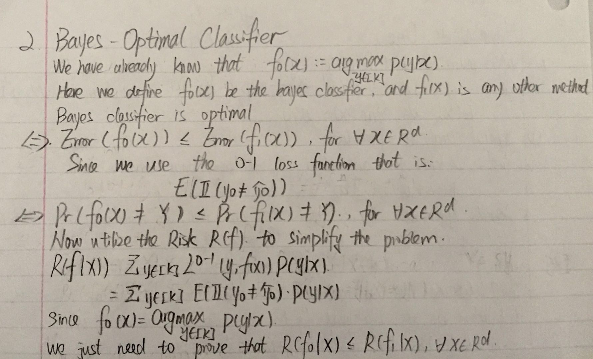

```{r setup, include=FALSE}
knitr::opts_chunk$set(echo = TRUE)
```

# Homework One
## problem one


## problem two




## problem three
1. load the data. I actually download the csv file from the yahoo finance after searching the stock information about apple.
```{r message=FALSE, warning=FALSE}
setwd("C:/Users/cheny/Desktop/study/second term/staistical machine learning/homework/homework one")
data <- read.csv('data.csv')
data <- data[1:30]
```

2. preform a PCA on the closing price and create the biplot
```{r}
PCA_1 <- princomp(data,cor = FALSE)
summary(PCA_1)
```

```{r}
screeplot(PCA_1,type = 'lines')
```
# only one componenet is enough

```{r}
biplot(PCA_1)
```

**analysis**

As we can see in the biplot, the first component explain almost all the variance of the data. Thus, we can see the arrows are almost all left or right direction. But the second component only have every little proportion of variance. Thus, in the up and down direction, the difference is very small. And as we can see from the screen plot, the first component count over 80% of the variance. 
This tells us that their is only one component.
For thoes company have long arrows is because the price of their stock is relatively high. Thus, the componenet have relative bigger inference on them. And the reason for many companies have the same direction is that maybe these companies are somekind of similar with each other.


```{r}
PCA_2 <- princomp(x = data,cor = TRUE)
summary(PCA_2)
```
```{r}
screeplot(PCA_2,type = 'lines')
```

```{r}
biplot(PCA_2,scale = 1)
```
**analysis**
After we calculate the z-socre of every data( after standardization), we treat all the data equally and ignore the scale of the data. In the first plot, the difference in the scale is so big that make other difference relatively lss important. But now, since we have exclude the impact of scale difference, we can see the influence of other factors more easily. Thus, we can see the data's difference are more obvious. The company will have different direction. 

```{r}
data2 <- read.csv('data2.csv')
PCA_3 <- princomp(x = data2,cor = TRUE)
summary(PCA_3)
```

```{r}
screeplot(PCA_3,type = 'lines')
```
```{r}
biplot(PCA_3,scale = 1)
```

** analysis**
Since in the plot we use the data of return to analysis. And the return tends to be more random compared with the price. Thus, we can see the data are all round the center of the plot. And the difference of the company can be shown more obviously.
As we can see that for every stock, the Proportion of Variance are about the same level. Thus, we can say that every stock are almost independent and move randomly. And we can see that they are in almost in the same direction in the first component. 
