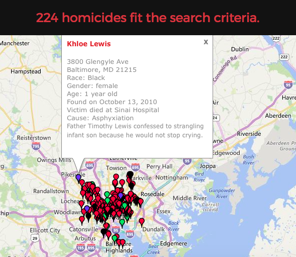

```{r, echo = FALSE}
set.seed(1) # Please don't remove this code!
```

# Instructions 
Before you leave lab today make sure that you upload a .pdf file to the canvas page (this should have a .pdf extension). This should be the PDF output after you have knitted the file, we don't need the .Rmd file (don't upload the one with the .Rmd extension).  The file you upload to the Canvas page should be updated with commands you provide to answer each of the questions below.  You can edit this file directly to produce your final solutions.  Note, however, in the file you upload you should the above header to have the date, your name, and your UNI.  Similarly, when you save the file you should replace **UNI** with your actualy UNI.

# Tasks

In this lab, we will use data from homicides in Baltimore City that are collected by the Baltimore Sun newspaper. The data is presented in a map that is publically available at the following website: \url{http://data.baltimoresun.com/news/police/homicides/}. I've scraped the data from the website and saved it in a file **BaltimoreHomicides.txt**.  Load the data with the following:

```{r}
data <- readLines("BaltimoreHomicides.txt")
```

The data we have corresponds to all the homicides in 2010.  There are 224 lines of HTML in the dataset (verify this using **length(data)**) and 224 homicides in 2010.

(1) In the image below, you can see one of the homicides in our dataset.  Use a **grep()** call to find which row in the dataset corresponds to the death of Khloe Lewis.  (You could search, for example, for her name and the row you should return is 52).  




```{r}
grep("Khloe Lewis", data)
```

(2) Suppose we wanted to identify the records for all the victims of shootings (as opposed to other causes).  Using the following bit of code and some of your own exploration, how many of the homicides in our dataset are the result of shootings?

```{r}
deaths1 <- grep("shooting", data)
deaths2 <- grep("Shooting", data)
length(deaths1)
length(deaths2)
setdiff(deaths1, deaths2)
```

In the above we can see that when we search for "shooting" we find 172 matches but only 171 matches when searching for "Shooting" and the two sets are identical except for row 105.  When we look at row 105:

```{r}
data[105]
```

we see that the cuse of the death was actually blunt force trauma, but in the description of the event, the word "shooting" appears.  So there are 171 homicides caused by shooting.

(3) The following code creates a vector of the ages of the homicide victims in the dataset:

```{r}
r       <- regexpr(">Age:\\s.*year(s)? old<", Baltimore)
age_vec <- regmatches(Baltimore, r)
age_vec <- substring(age_vec, 2, nchar(age_vec) - 1)
head(age_vec)
```

(a) Explain what the regular expression ">Age:\\s.*years old<" searches for.

The regular expression looks for the string ">Age: " exactly, followed by anything, then the string "years old<" exactly.

(b) Explain in words what the output of the first line of code provides.

The first line of code returns the starting character of the regular expression in each row of the data set and also the length of each match.


(c) The second line of code.

The second line of code returns the actual matches (including the brackets ">" and "<").

(d) The third line of code.

The third line of code removes the brackets ">" and "<", returning only the string "Age: __ years old" for each individual.

(4) Use the same strategy as we used in question (3) to create a vector holding each victims' name.  Hint: I had to use the fact that the first letter of the name is capitalized and the specific structure of the HTML code after the name in writing my regular expression.

```{r}
r       <- regexpr(">[A-Z]+.*</a></dt>", data)
name_vec <- regmatches(data, r)
name_vec <- substring(name_vec, 2, nchar(name_vec) - 9)
head(name_vec)
```